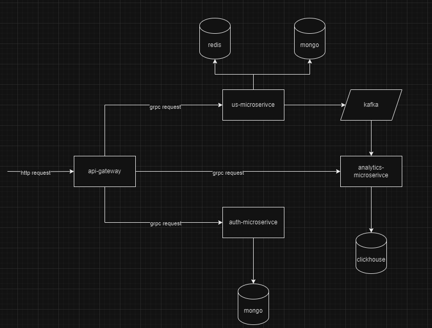

Project: Short URL Service


## How to Run
```bash
docker-compose up --build
```

## System Design 



### Splitting into microservices

```plain
Separating functionality into microservices allows for scalability, flexibility, and fault tolerance. In this project, the functionality is divided into the following microservices:

1. UrlShorteningService: responsible for generating short links and storing them.
2. AnalyticsService: collects statistics on link accesses.
3. AuthService: responsible for user authentication and authorization.
4. ApiGateway: provides a single entry point for all clients, delegating requests to the appropriate microservices.

Reasons for separating functionality:
1. UrlShorteningService and AnalyticsService have different scalability and performance requirements.
2. AuthService can be used by other services in the future.
3. ApiGateway simplifies the management and coordination of interactions between clients and microservices.
```
### Выбор способа коммуникации
```plain
gRPC: Used for inter-service communication, as it provides high performance and efficient data serialization. This is especially important for services that need to process a large number of requests with minimal latency.
Kafka: Used for asynchronous messaging between microservices, which allows processing large amounts of data in real time and improves system fault tolerance.

Selection logic:
gRPC is suitable for requests that require an immediate response, such as creating a short link.
Kafka is suitable for transmitting events that can be processed asynchronously, such as collecting link access statistics.
```
### Выбор базы данных
```plain
ClickHouse: Chosen for storing analytical data due to its high performance when executing complex queries and processing large volumes of data.
MongoDB: Chosen for storing user data and short links due to its flexibility and horizontal scalability.

Reasons for choosing:
ClickHouse provides powerful tools for analytics, such as aggregate functions and materialized views.
MongoDB provides flexibility in working with unstructured data and is easy to scale.
```


### REST API Документация
1. Create a short link

Endpoint: POST /createUrl

Description: This endpoint is used to create a short link to the specified original URL.
Request Body:

```json
{
"original_url": "https://example.com"
}
```
Response Body:

```json
{
"short_url": "http://short.url/abc123"
}
```
HTTP Codes:
```
201 Created: Successfully created short link.
400 Bad Request: Invalid request (e.g. missing required field).
500 Internal Server Error: Server-side error.
```

2. Getting the original URL from a short link

Endpoint: GET /getUrl

Description: This endpoint is used to get the original URL from a short link.
Request Parameters:
```json
"short_url": "gwgsd".
```
Response Body:
```json
{
"original_url": "https://example.com"
}
```
HTTP Codes:
```
302 Found: Successful redirect to original URL.
404 Not Found: Short link not found.
500 Internal Server Error: Server-side error.
```

3.Getting statistics by URL

Endpoint: GET /getUrlStats

Description: This endpoint is used to get statistics on the number of requests to the specified URL.

Request Parameters:
```json
{
  "short_url": "fwfwf"
}
```
Response Body:

```json
{
"short_url": "http://short.url/abc123",
"access_count": 42
}
```
HTTP Codes:
```
200 OK: Successfully retrieved statistics.
404 Not Found: Short link not found.
500 Internal Server Error: Error on the server side.
```

4.User Registration

Endpoint: POST /register

Description: This endpoint is used to register a new user.

Request Body:

```json
{
"email": "user@example.com",
"password": "securepassword"
}
```
Response Body:

```json
{
"user_id": 12345
}
```
HTTP Codes:
```
201 Created: User successfully registered.
400 Bad Request: Invalid request (e.g., required field missing).
409 Conflict: User with this email already exists.
500 Internal Server Error: Server-side error.
```

5. User login

Endpoint: POST /login

Description: This endpoint is used to authenticate the user.

Request Body:

```json
{
"email": "user@example.com",
"password": "securepassword"
}
```
Response Body:

```json
{
"token": "jwt-token"
}
```
HTTP Codes:
```
200 OK: The user has been successfully authenticated.
400 Bad Request: Invalid request (e.g. a required field is missing).
401 Unauthorized: Invalid email or password.
500 Internal Server Error: Ошибка на стороне сервера.
``` 
